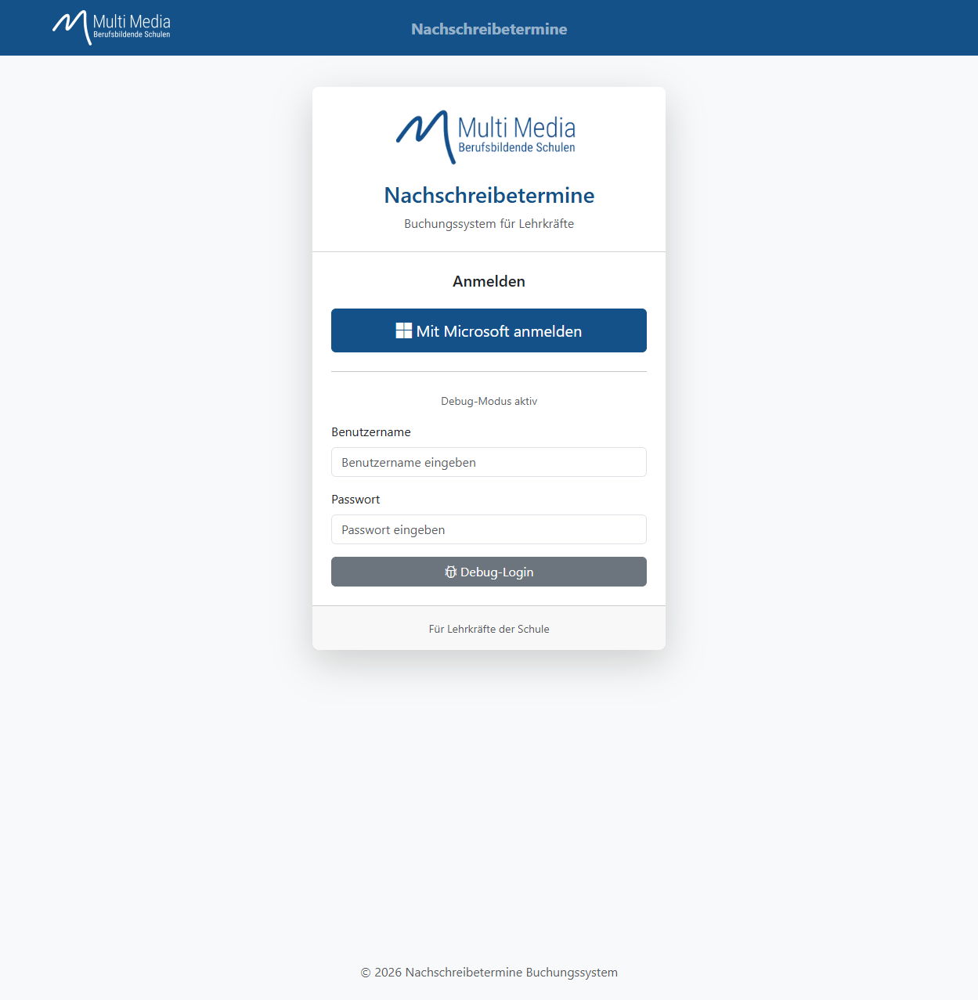
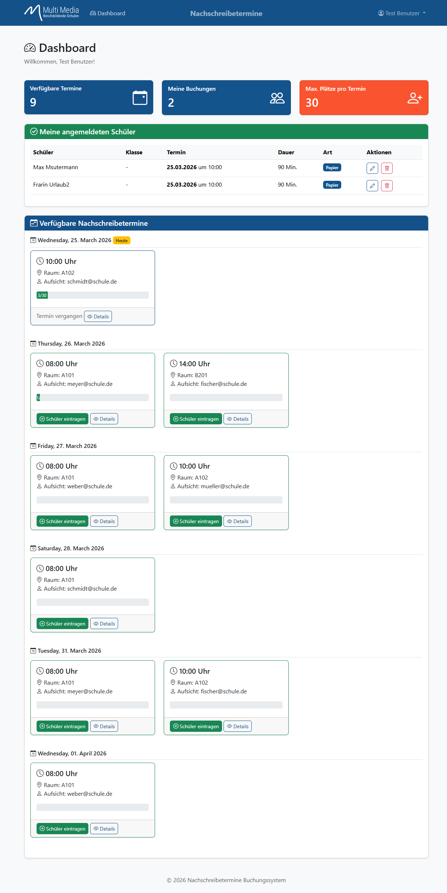
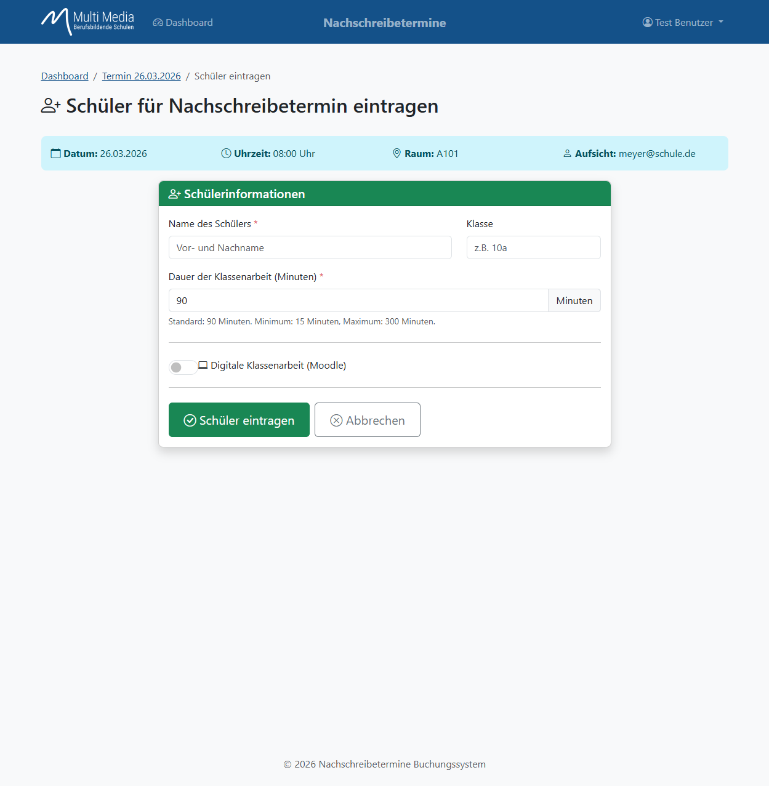
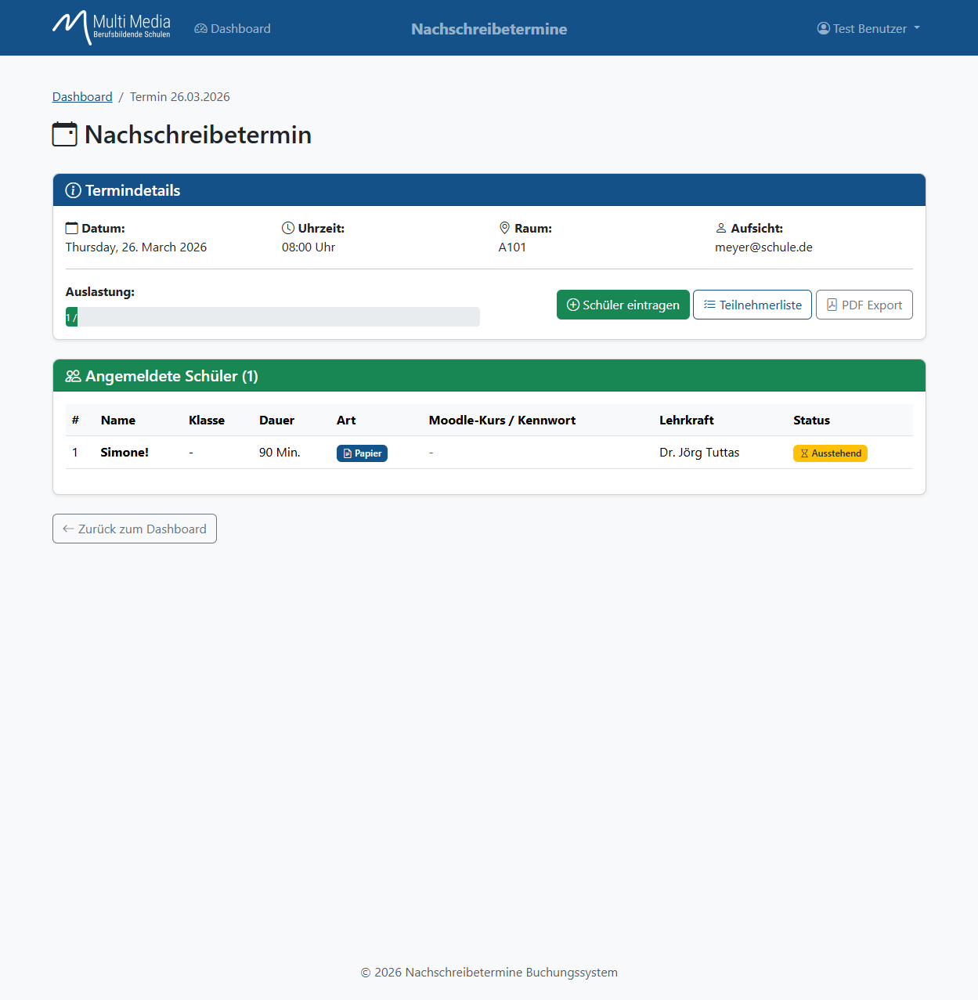
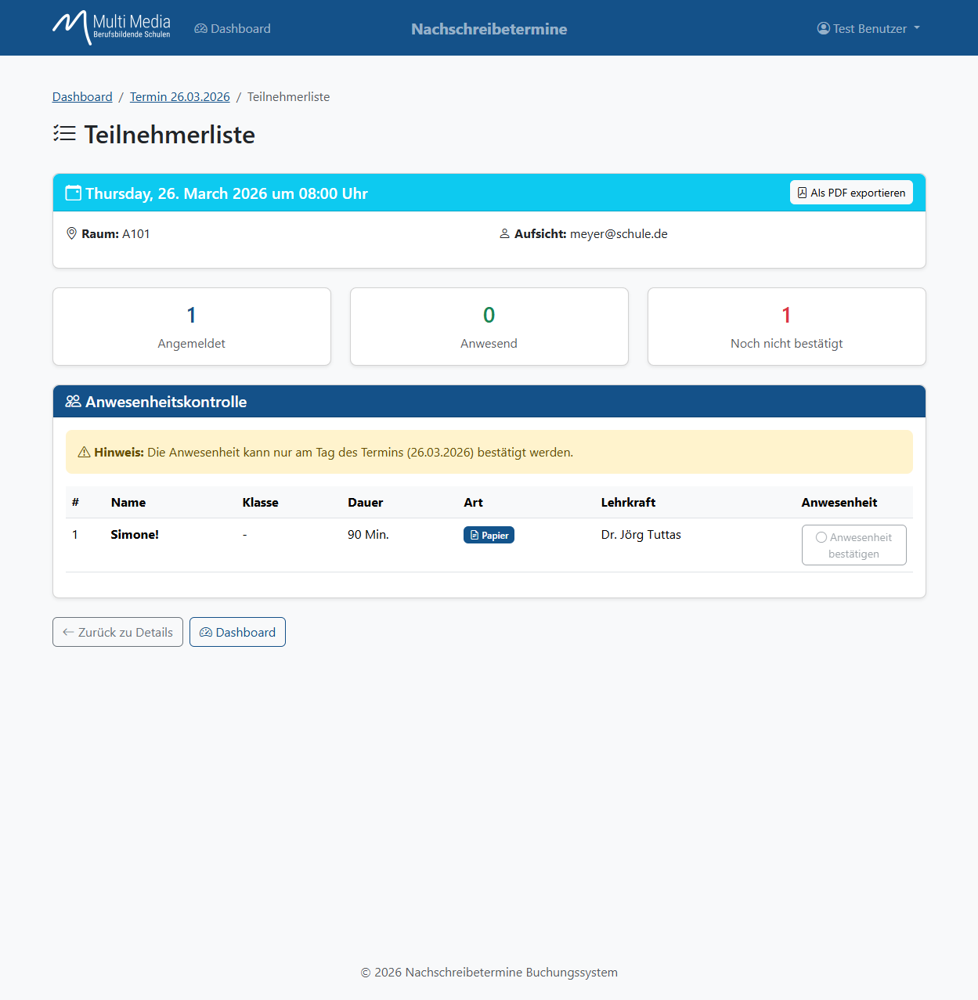

# Benutzeranleitung - Nachschreibetermine Buchungssystem

Diese Anleitung beschreibt die Nutzung des Nachschreibetermine Buchungssystems für Lehrkräfte.

---

## Inhaltsverzeichnis

1. [Anmeldung](#1-anmeldung)
2. [Dashboard](#2-dashboard)
3. [Schüler für Termin eintragen](#3-schüler-für-termin-eintragen)
4. [Termindetails anzeigen](#4-termindetails-anzeigen)
5. [Teilnehmerliste & Anwesenheit](#5-teilnehmerliste--anwesenheit)

---

## 1. Anmeldung

Die Anmeldung erfolgt über zwei Möglichkeiten:

### Microsoft-Login (Produktiv)
Klicken Sie auf den Button **"Mit Microsoft anmelden"**, um sich mit Ihrem Schulkonto anzumelden. Sie werden zur Microsoft-Anmeldeseite weitergeleitet.

### Debug-Login (nur Testumgebung)
In der Testumgebung steht zusätzlich ein Debug-Login zur Verfügung:
- **Benutzername:** `user`
- **Passwort:** `user`

---

## 2. Dashboard

Nach der Anmeldung gelangen Sie zum Dashboard. Hier sehen Sie auf einen Blick:

### Statistik-Karten (oben)
- **Verfügbare Termine:** Anzahl der offenen Nachschreibetermine
- **Meine Buchungen:** Anzahl Ihrer eingetragenen Schüler

### Meine eingetragenen Schüler (links)
Eine Liste aller Schüler, die Sie für Nachschreibetermine eingetragen haben, mit:
- Name und Klasse
- Datum des Termins
- Status (angemeldet/anwesend)

### Terminübersicht (rechts)
Alle verfügbaren Nachschreibetermine als Karten mit:
- **Datum und Uhrzeit**
- **Raum**
- **Aufsicht** (zuständige Lehrkraft)
- **Kapazität** (angemeldet / maximal)

Klicken Sie auf **"Schüler eintragen"**, um einen Schüler für diesen Termin anzumelden.

---

## 3. Schüler für Termin eintragen

Auf der Buchungsseite tragen Sie Schülerdaten ein:

### Formularfelder

| Feld | Beschreibung |
|------|--------------|
| **Name des Schülers** | Vor- und Nachname des Schülers |
| **Klasse** | Klassenbezeichnung (z.B. 10a, FGT12) |
| **Dauer in Minuten** | Benötigte Zeit für die Nachschreibearbeit |
| **Digitale Prüfung** | Checkbox, falls ein PC benötigt wird |

### Speichern
Klicken Sie auf **"Buchung speichern"**, um den Schüler einzutragen.

> **Hinweis:** Ein Schüler kann nicht mehrfach für denselben Termin eingetragen werden.

---

## 4. Termindetails anzeigen

Klicken Sie im Dashboard auf einen Termin, um die Details zu sehen:

### Terminübersicht
- Datum und Uhrzeit
- Raum
- Aufsicht (mit E-Mail)

### Angemeldete Schüler
Eine Tabelle mit allen für diesen Termin angemeldeten Schülern:
- Name und Klasse
- Dauer der Arbeit
- Art (Digital/Papier)
- Eintragung durch (Lehrkraft)

### PDF-Export
Klicken Sie auf **"Als PDF exportieren"**, um eine Teilnehmerliste als PDF herunterzuladen.

### Navigation
- **Teilnehmerliste:** Zur Anwesenheitskontrolle
- **Dashboard:** Zurück zur Übersicht

---

## 5. Teilnehmerliste & Anwesenheit

Die Teilnehmerliste dient der Anwesenheitskontrolle am Tag des Termins.

### Statusübersicht
Drei farbige Karten zeigen den aktuellen Status:
- **Angemeldet:** Gesamtzahl der eingetragenen Schüler
- **Anwesend:** Bereits bestätigte Anwesenheiten
- **Noch nicht bestätigt:** Offene Bestätigungen

### Anwesenheitskontrolle
Die Tabelle zeigt alle angemeldeten Schüler mit:
- Name und Klasse
- Dauer und Art (Digital/Papier)
- Lehrkraft
- **Anwesenheit bestätigen:** Button zum Bestätigen der Anwesenheit

> **Wichtig:** Die Anwesenheit kann nur am Tag des Termins bestätigt werden!

### PDF-Export
Auch hier können Sie die Liste als PDF exportieren.

---

## Tipps & Hinweise

### Schnellnavigation
- Nutzen Sie das **Dashboard** als Startpunkt für alle Aktionen
- Die Breadcrumb-Navigation (z.B. "Dashboard / Termin 26.03.2026") hilft bei der Orientierung

### Prüfungsarten
- **Papier:** Symbol mit "Papier" - klassische schriftliche Prüfung
- **Digital:** Symbol mit Bildschirm - PC-basierte Prüfung

### Bei Problemen
Wenden Sie sich an Ihren Administrator oder die IT-Abteilung.

---

*© 2026 Nachschreibetermine Buchungssystem*
