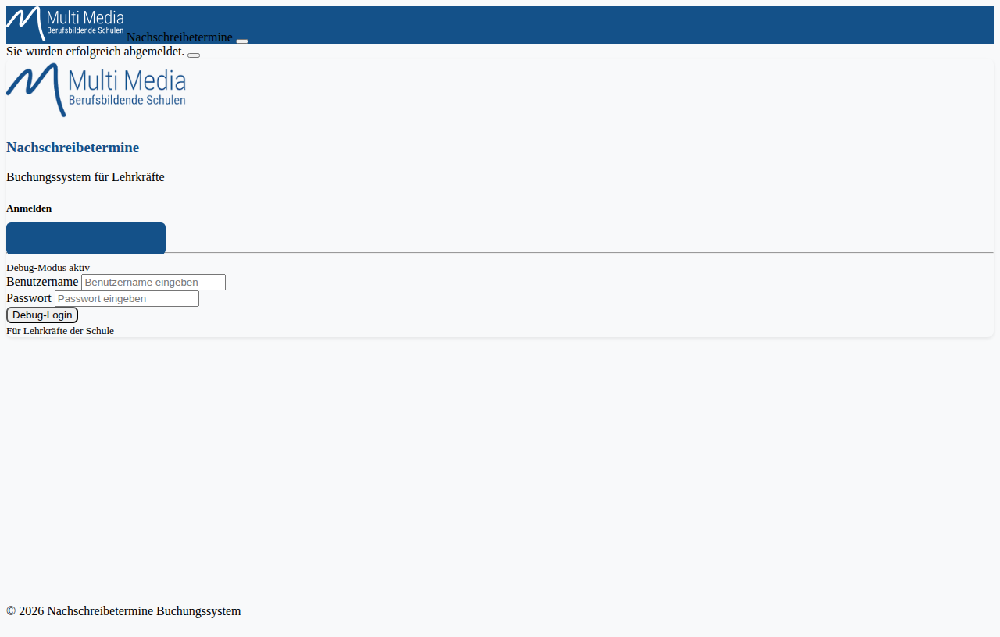
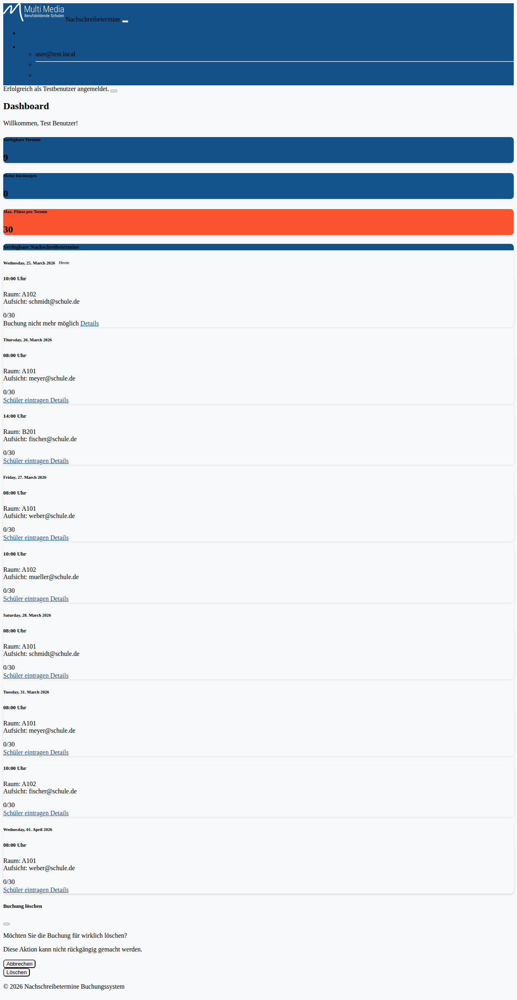
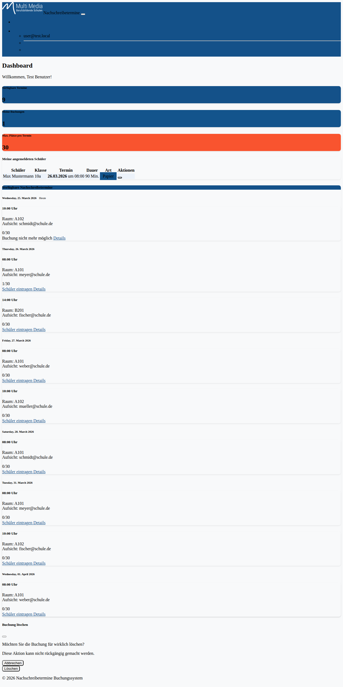
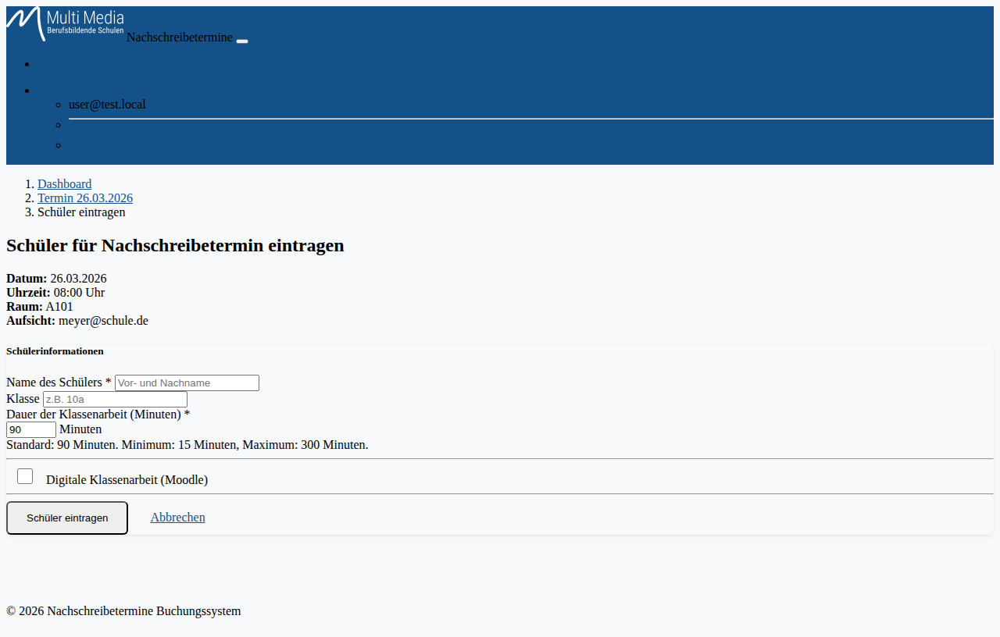
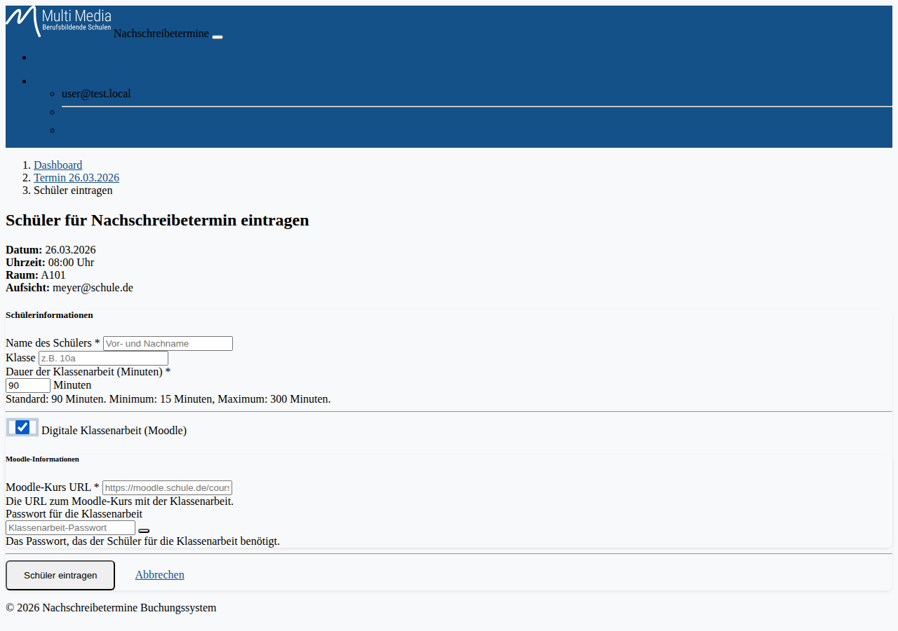
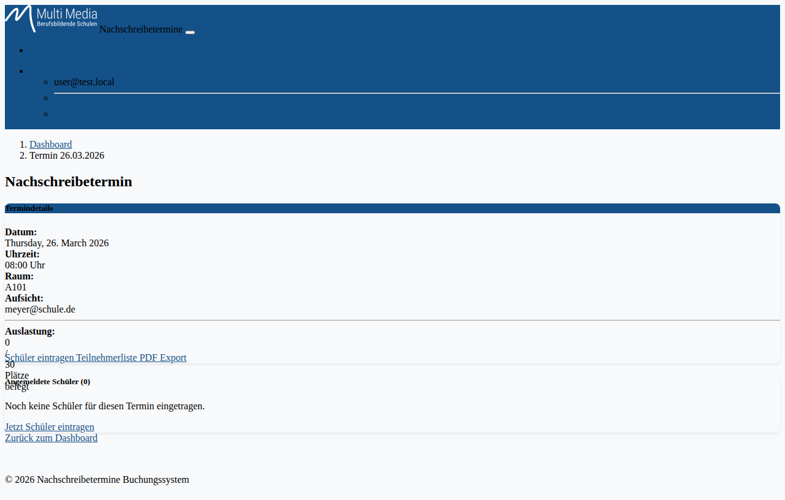
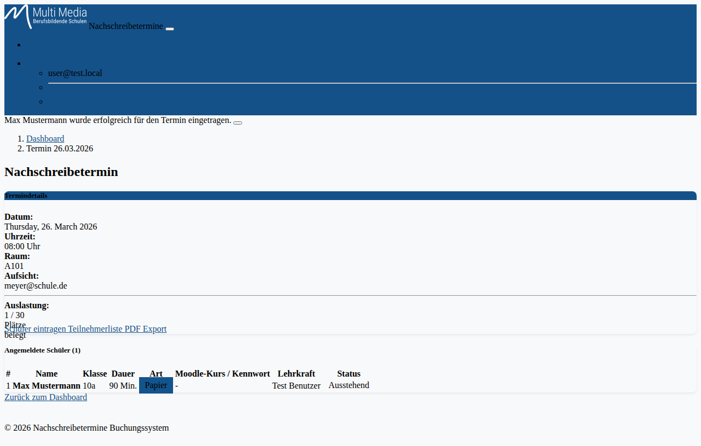
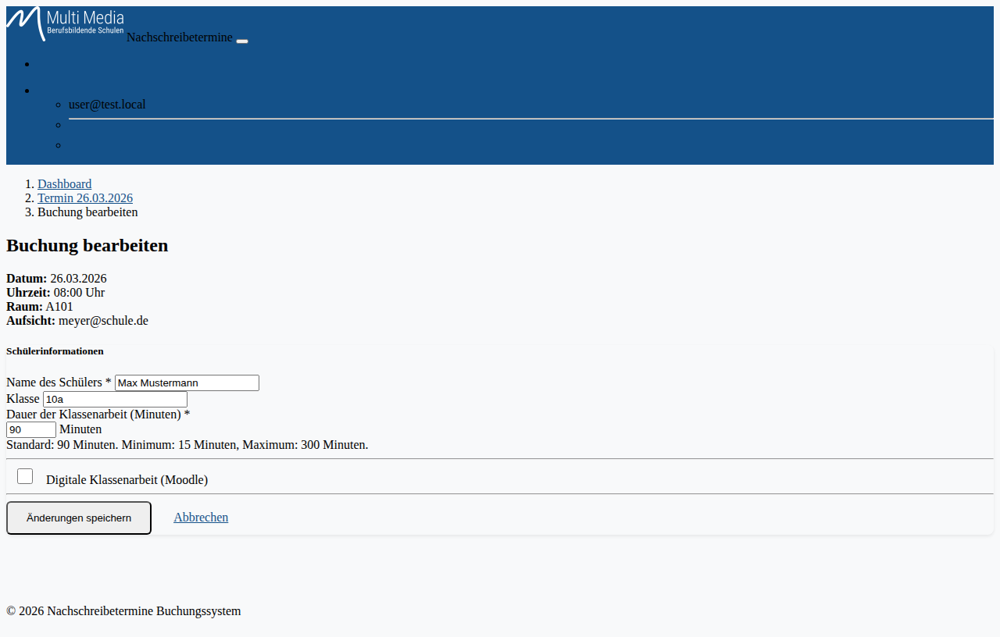
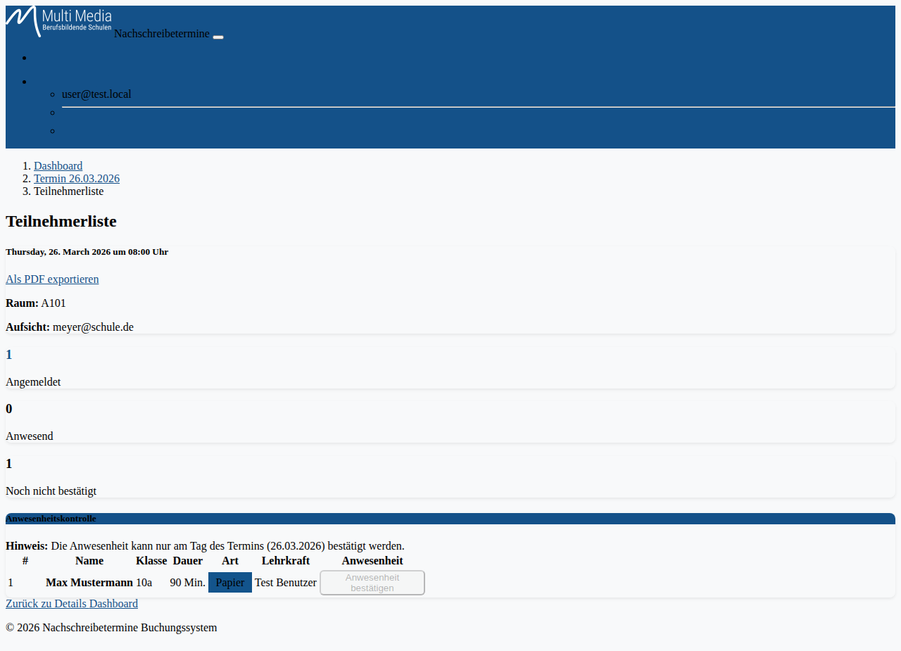

# Benutzerdokumentation – Nachschreibetermine Buchungssystem

## Inhaltsverzeichnis

1. [Übersicht](#1-übersicht)
2. [Anmeldung](#2-anmeldung)
3. [Dashboard](#3-dashboard)
4. [Nachschreibetermin buchen](#4-nachschreibetermin-buchen)
   - 4.1 [Schüler eintragen (Papierklassenarbeit)](#41-schüler-eintragen-papierklassenarbeit)
   - 4.2 [Schüler eintragen (Digitale Klassenarbeit)](#42-schüler-eintragen-digitale-klassenarbeit)
5. [Termindetails anzeigen](#5-termindetails-anzeigen)
6. [Buchung bearbeiten](#6-buchung-bearbeiten)
7. [Buchung löschen](#7-buchung-löschen)
8. [Teilnehmerliste und Anwesenheitskontrolle](#8-teilnehmerliste-und-anwesenheitskontrolle)
9. [PDF-Export](#9-pdf-export)
10. [Abmelden](#10-abmelden)

---

## 1. Übersicht

Das **Nachschreibetermine Buchungssystem** ist eine Web-Anwendung für Lehrkräfte an berufsbildenden Schulen. Es ermöglicht:

- die Übersicht aller verfügbaren Nachschreibetermine,
- das Eintragen von Schülerinnen und Schülern für einen Nachschreibetermin,
- die Verwaltung eigener Buchungen (Bearbeiten, Löschen),
- die Anwesenheitskontrolle am Prüfungstag sowie
- den Export der Teilnehmerliste als PDF.

---

## 2. Anmeldung

Öffnen Sie die Anwendung im Browser. Sie gelangen zur Anmeldeseite.

Es stehen zwei Anmeldemethoden zur Verfügung:

| Methode | Beschreibung |
|---------|-------------|
| **Mit Microsoft anmelden** | Produktivbetrieb – Anmeldung über das Azure Active Directory der Schule |
| **Debug-Login** | Testbetrieb – Anmeldung mit lokalem Testkonto |

### Anmeldung im Debug-Modus (Testbetrieb)

Wenn der Debug-Modus aktiviert ist (erkennbar am Hinweis „Debug-Modus aktiv"), geben Sie folgende Zugangsdaten ein:

- **Benutzername:** `user`
- **Passwort:** `user`

Klicken Sie anschließend auf **Debug-Login**.

> **Hinweis:** Der Debug-Login ist nur für Test- und Entwicklungszwecke vorgesehen. Im Produktivbetrieb erfolgt die Anmeldung ausschließlich über Microsoft.

---

## 3. Dashboard

Nach der erfolgreichen Anmeldung werden Sie zum **Dashboard** weitergeleitet.

Das Dashboard bietet auf einen Blick:

### Statistik-Karten (oben)

| Karte | Beschreibung |
|-------|-------------|
| **Verfügbare Termine** | Anzahl der aktuell buchbaren Nachschreibetermine |
| **Meine Buchungen** | Anzahl der von Ihnen gebuchten Schüler |
| **Max. Plätze pro Termin** | Maximale Kapazität pro Termin (Standard: 30) |

### Meine angemeldeten Schüler

Sofern Sie bereits Buchungen vorgenommen haben, erscheint eine Übersichtstabelle Ihrer angemeldeten Schüler mit Bearbeiten- und Löschen-Funktionen.

### Verfügbare Nachschreibetermine

Alle zukünftigen Termine werden nach Datum gruppiert angezeigt. Jede Terminkarte zeigt:

- **Uhrzeit** und **Raum**
- Name der **Aufsichtsperson**
- **Auslastungsbalken** (grün = freie Plätze, gelb = fast voll, rot = ausgebucht)
- Schaltfläche **Schüler eintragen** (nur wenn Buchung möglich)
- Schaltfläche **Details**

> Ein Termin mit dem Badge **Heute** ist der aktuelle Tageseintrag. Die Buchung ist nur bis zum **Vortag** möglich.

---

## 4. Nachschreibetermin buchen

Um einen Schüler für einen Nachschreibetermin einzutragen, klicken Sie auf die grüne Schaltfläche **Schüler eintragen** auf der Terminübersichtskarte im Dashboard oder auf der Termindetailseite.

### 4.1 Schüler eintragen (Papierklassenarbeit)

Füllen Sie das Formular aus:

| Feld | Pflichtfeld | Beschreibung |
|------|-------------|-------------|
| **Name des Schülers** | Ja | Vor- und Nachname des Schülers |
| **Klasse** | Nein | z. B. `10a` |
| **Dauer der Klassenarbeit (Minuten)** | Ja | Standard: 90 Min., Minimum: 15 Min., Maximum: 300 Min. |
| **Digitale Klassenarbeit (Moodle)** | Nein | Schalter für digitale Prüfungen – standardmäßig deaktiviert |

Klicken Sie abschließend auf **Schüler eintragen**, um die Buchung zu speichern.

### 4.2 Schüler eintragen (Digitale Klassenarbeit)

Aktivieren Sie den Schalter **Digitale Klassenarbeit (Moodle)**, um zusätzliche Felder für Moodle-Prüfungen einzublenden.

Zusätzliche Pflichtangaben für digitale Klassenarbeiten:

| Feld | Pflichtfeld | Beschreibung |
|------|-------------|-------------|
| **Moodle-Kurs URL** | Ja | Vollständige URL des Moodle-Kurses, z. B. `https://moodle.schule.de/course/view.php?id=...` |
| **Passwort für die Klassenarbeit** | Nein | Prüfungspasswort für den Schüler (kann über das Augen-Symbol sichtbar gemacht werden) |

---

## 5. Termindetails anzeigen

Klicken Sie auf **Details** in einer Terminübersichtskarte, um zur Detailansicht des Termins zu gelangen.

Die Detailseite zeigt:

- **Termininformationen**: Datum, Uhrzeit, Raum und Aufsicht
- **Auslastungsbalken**: Anteil belegter Plätze
- **Schaltflächen**: Schüler eintragen, Teilnehmerliste aufrufen, PDF exportieren
- **Tabelle aller angemeldeten Schüler** mit Name, Klasse, Dauer, Art der Arbeit, Moodle-Link/Passwort, Lehrkraft und Anwesenheitsstatus

### Spalten in der Schülertabelle

| Spalte | Beschreibung |
|--------|-------------|
| **#** | Laufende Nummer |
| **Name** | Name des Schülers |
| **Klasse** | Klasse des Schülers |
| **Dauer** | Dauer der Klassenarbeit in Minuten |
| **Art** | Badge `Papier` oder `Digital` |
| **Moodle-Kurs / Kennwort** | Moodle-Link und ggf. Passwort (nur bei digitalen Arbeiten) |
| **Lehrkraft** | Eintragende Lehrkraft |
| **Status** | `Anwesend` (grün) oder `Ausstehend` (gelb) |

---

## 6. Buchung bearbeiten

Sie können eine bestehende Buchung bearbeiten, solange der Termin noch nicht stattgefunden hat.

**Möglichkeit 1:** Über das Dashboard in der Tabelle „Meine angemeldeten Schüler" auf das Stift-Symbol klicken.

**Möglichkeit 2:** In der Detailansicht des Termins die URL direkt aufrufen.

Das Formular ist identisch mit dem Eintragungsformular und zeigt die bereits gespeicherten Daten vorausgefüllt an. Nehmen Sie Ihre Änderungen vor und klicken Sie auf **Änderungen speichern**.

---

## 7. Buchung löschen

Um eine Buchung zu löschen, klicken Sie im Dashboard in der Tabelle „Meine angemeldeten Schüler" auf das rote Papierkorb-Symbol.

Es öffnet sich ein Bestätigungsdialog:

> **„Möchten Sie die Buchung für [Schülername] wirklich löschen?"**

- Klicken Sie auf **Löschen**, um die Buchung endgültig zu entfernen.
- Klicken Sie auf **Abbrechen**, um den Vorgang abzubrechen.

> **Achtung:** Das Löschen einer Buchung kann nicht rückgängig gemacht werden.

---

## 8. Teilnehmerliste und Anwesenheitskontrolle

Die Teilnehmerliste ist über die Detailansicht eines Termins über den Button **Teilnehmerliste** erreichbar.

### Statistik-Karten

Oben auf der Seite werden drei Kennzahlen angezeigt:

| Karte | Bedeutung |
|-------|-----------|
| **Angemeldet** | Gesamtzahl der eingetragenen Schüler |
| **Anwesend** | Anzahl bestätigter Anwesenheiten |
| **Noch nicht bestätigt** | Anzahl ausstehender Anwesenheiten |

### Anwesenheit bestätigen

> **Wichtig:** Die Anwesenheitsbestätigung ist ausschließlich **am Tag des Termins** möglich. Die Schaltfläche „Anwesenheit bestätigen" ist an anderen Tagen deaktiviert.

Am Prüfungstag erscheint für jeden Schüler die aktive Schaltfläche **Anwesenheit bestätigen**. Klicken Sie darauf, um die Anwesenheit des Schülers zu vermerken. Der Status wechselt dann von `Ausstehend` auf `Anwesend`.

---

## 9. PDF-Export

Auf der Detailseite eines Termins sowie auf der Teilnehmerliste steht der Button **PDF Export** bzw. **Als PDF exportieren** zur Verfügung. Damit wird die aktuelle Teilnehmerliste als PDF-Datei heruntergeladen, z. B. für den Ausdruck im Prüfungsraum.

---

## 10. Abmelden

Klicken Sie oben rechts in der Navigationsleiste auf Ihren **Benutzernamen**, um das Dropdown-Menü zu öffnen. Wählen Sie **Abmelden**, um die aktuelle Sitzung zu beenden und zur Anmeldeseite zurückzukehren.

---

## Technische Hinweise

- Die Buchungsfrist endet am **Vortag des Termins**. Danach ist keine Buchung mehr möglich.
- Pro Termin sind maximal **30 Schüler** buchbar (konfigurierbar durch den Administrator).
- Automatische **E-Mail-Berichte** werden täglich um 23:59 Uhr an die Aufsichtspersonen versandt.
- Die Anwendung ist **mobil-responsiv** und kann auf Smartphones und Tablets genutzt werden.
